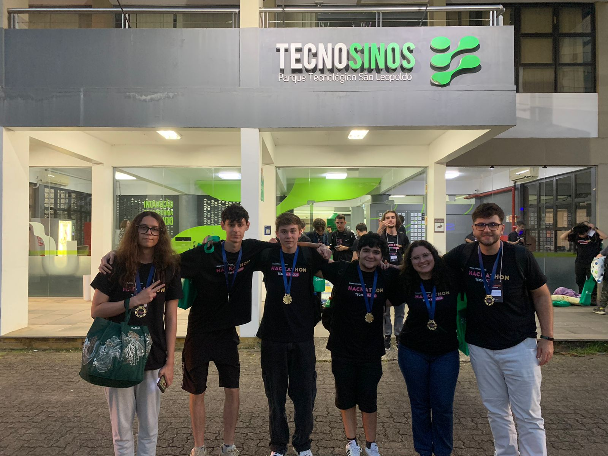
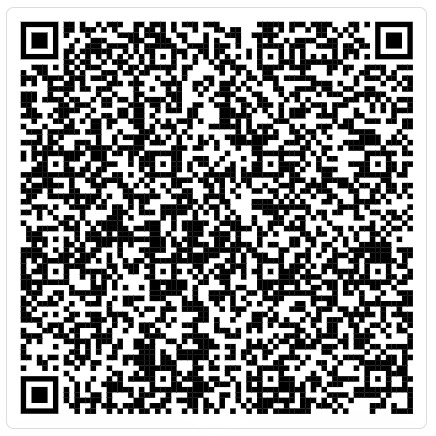
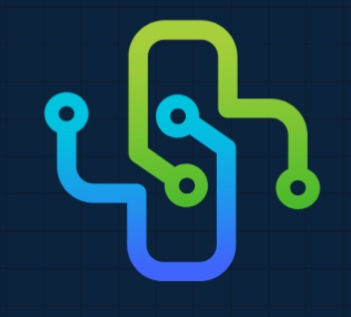

# Projeto Hackathon Tech+Saúde - Segunda Edição

## INTEGRANTES:

| NOME | GITHUB|
| ---------------- | ----------------|
| Bernardo Varisco Fleck | https://github.com/bernardoeeee|
| Francisco Pes de Mello | https://github.com/franciscoMello777 |
| Gabriel Garcez de Oliveira | https://github.com/gabiss1|
| Marcelo de Carli Rocha | https://github.com/marcelodecarli|
| Miguel Donato de Miranda | https://github.com/miguelmdtz|
| Victor Flores Alves Mota | https://github.com/VictorFloresAlvesMota |
| Vitória Faller | https://github.com/|

<figure>
  
  <figcaption>EQUIPE (obs: alguns colegas tinham ido embora já)</figcaption>
</figure>

# LINKS ÚTEIS

## Figma

- https://www.figma.com/design/D37ZmD2EuUAkZd2sCQd18n/Untitled?node-id=55-95

  - Imagem QRCode Figma

  

## Canva
 - https://www.canva.com/design/DAGXXUcMeKU/y6FQXwqHeGKFQKrfm3aweQ/edit

# IMAGENS

<figure>
  
  <figcaption>LOGO INICIAL</figcaption>
</figure>
<figure>
  
  <figcaption>LOGO SEM FUNDO</figcaption>
</figure>
<figure>
  
    <figcaption>TITULO / NOME</figcaption>
</figure>

  
